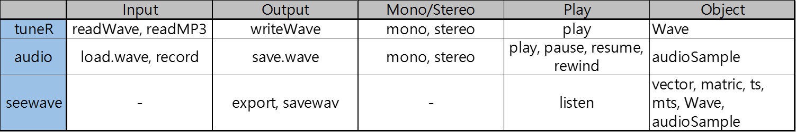

```{r setup, echo=FALSE, message=FALSE, warning=FALSE, results='hide'}
rm(list = ls()); gc()
library(knitr)
library(kableExtra)
library(dplyr)
library(tuneR)
library(seewave)
library(audio)
knitr::opts_chunk$set(
	echo = TRUE,
	message = FALSE,
	warning = FALSE
)
```

# File Target

manipulate the voice data.

- In(supported file format)
- Out
- Mono and Stereo
- Play Sound
- summary

# reference

[seewaveIO](https://cran.r-project.org/web/packages/seewave/vignettes/seewave_IO.pdf)

---

packages require

```{r eval = F}
library(dplyr)
library(tuneR)
library(seewave)
library(audio)
```

## In(supported file format)

seewave 套件整合了 tuneR 與 audio 套件。

支援三種類型的資料格式。

- usual classes: numeric vector, numeric matrix
- time series classes: ts, mts
- sound-specific classes: Wave(tuneR) and audioSample(audio)

## usual classes

### numeric vector

只要提供取樣綠(sampling frequency)，numeric 的數據可以被視為 sound。  
以下是製造 440Hz 的聲音，取樣率為8000Hz，時間長達一分鐘。

```{r}
s1 <- sin(2*pi*440*seq(0,1,length.out = 8000))
is.vector(s1)
mode(s1)
oscillo(wave = s1, f = 8000)
```

### numeric matrix

單一欄位的 matrix，只要提供取樣頻率(sampling frequency)，依樣可以被視為 sound。

```{r}
s2 <- as.matrix(s1)
is.matrix(s2)
dim(s2)
oscillo(wave = s2, f = 8000)
```

--

如果 matrix 有超過一欄，則只有第一欄會被使用。

```{r}
x <- rnorm(8000)
s3 <- cbind(s2, x)
s3 %>% head
is.matrix(s3)
dim(s3)
oscillo(wave = s3, f = 8000)
```

---
## Time series

可以使用 ts(), as.ts(), is.ts()，來製作 class ts 的聲音格式。

```{r}
s4 <- ts(data = s1, start = 0, frequency = 8000)
str(s4)
```

to generate a 0.5 sec random noise.  
注意到，如果不是轉換成 ts 格式的方式，而是給參數自動生成，  
則 ts 會多生成一個數據點，最後一個數據點會和第一個相同。

簡單來說就是數據被重複循環了。

```{r}
s4 <- ts(data = rnorm(4000), start = 0, end = 0.5, frequency = 8000)
str(s4)
head(s4, 1); tail(s4, 1)
```

從聲音數據，取得 sampling frequency, time resolution

```{r}
frequency(s4)
deltat(s4) #1/frequency(s4)
```

因為本身就是聲音數據了。所以不地在給予取樣頻率，即可直接畫圖。

```{r}
oscillo(wave = s4)
```

如果有多個 time series，類似 matrix 有多個欄位的情況，  
seewave 套件只會處理第一個 series。

```{r}
s5 <- ts(data = s3, f = 8000)
class(s5)
oscillo(s5)
```

---

## Specific sound classes

For binary wav format or the compressed mps format.

- the class `Wave` object of the package `tuneR`
- the class `audioSample` object of the package `audio`

### Wave class (package tuneR)

Read .wmv data (package tuneR)

```{r}
s6 <- readWave(filename = "../data/wmv/1kHz_44100Hz_16bit_05sec.wav")
```

read 前兩秒的 聲音，可以用 from, to, units("sample", "seconds", "hours")做控制。

```{r}
s7 <- readWave(filename = "../data/wmv/1kHz_44100Hz_16bit_05sec.wav", from = 0, to = 2, units = "seconds")
s7
```

- 取樣頻率為 44100次/每秒。  
- 聲音長度為 2秒。  
- 取樣點為 44100*2=88200 個數據。
- Mono為單聲道。
- 16 Bit 的解析度。

p.s. 不管是聲音或者是其他信息，只要是經過取樣與量化得到的資料，總稱 PCM data 。「脈衝編碼調變 pulse-code modulation, PCM 」源自訊號學。

--

MP3的檔案也可以讀取。
Read .mp3 data (package tuneR)

```{r}
mp3 <- readMP3(filename = "../data/mp3/1kHz_44100Hz_16bit_05sec.mp3")
mp3
```

--

取出數據與聲音特性。

```{r}
s7@left %>% head
s7@right %>% head
s7@stereo
s7@samp.rate
s7@bit
s7@pcm
```

聲音的數值會界在 $\pm2^{bit-1}$

```{r}
s7@left %>% range()
```

--

### audioSample class (package audio)

- mono: a numeric vector
- stereo: a numeric matrix with two rows

```{r}
s10 <- load.wave(where = "../data/wmv/1kHz_44100Hz_16bit_05sec.wav")
s10 %>% head
s10$rate
s10$bits
```

audio 套件有一個好處是可以直接從 R 錄製聲音。  
一共有四個 finctions 可以做操作: record, pause, rewind, resume

```{r eval = F}
s11 <- rep(NA, 16000*5)
t1 <- record(where = s11, rate = 16000, channels = 1)
pause(x = t1)
play(s11)
s11 %>% head
```

下面是一個幫放音訊的小範例。  
更多請看: [audio - Audio Interface for R - RForge.net](http://www.rforge.net/audio/)

```{r eval = F}
a <- play(sin(1:100000/20))
a
# Audio player instance 63b770 of AudioUnits (Mac OS X) driver (macosx).
# Audio player instance 5ff92a90 of Windows MultiMedia audio driver (wmm).
wait(a) # wait for the playback to finish
rewind(a)
resume(a) # play again
```

---

# Out

## .txt file

可以輸出成 txt file，windows 的用戶還可以跟 Goldwave 軟體介接。

```{r}
data(tico)
export(wave = tico, f = 22050, header = F)
export(wave = tico, f = 22050, header = T)
export(wave = tico, f = 22050, header = T, filename = "tico4Goldwave.txt")

# 自定義 header
export(wave = tico, f = 22050, header = "f=22050; ch=left", filename = "tico4Goldwave.txt")
```

## .wav file

- tuneR: writeWave
- tuneR: save.wave

seewave 使用 tuneR 的 writeWave 為底，儲存的函式為 savewav()

```{r}
savewav(tico, f = 22050)
```

```{r}
ticofirst <- cutw(wave = tico, f = 22050, from = 0, plot = T, to = 0.5, output = "Wave")
savewav(wave = ticofirst, filename = "tico_firstnote.wav")
```

## .flac file

FLAC是一款的音訊壓縮編碼，其特點是可以對音訊檔無失真壓縮。  
不同於其他有損壓縮編碼(如MP3、AAC等)，壓縮後不會有任何音質損失，  
現在已被很多軟體及硬體音訊產品所支援。

要使用的話，電腦必須先安裝 FLAC 的程式。

```{r eval = F}
wav2flac("./tico_firstnote.wav", overwrite = T)
wav2flac("./tico_firstnote.flac", reverse = T)
```

---

# Mono and Stereo

單聲道與雙聲道。  

製造雙聲道聲音

```{r}
LF <- sine(440)
RI <- sine(2000)
s12 <- stereo(LF, RI)
s12
```

轉換回單生道

```{r}
s13 <- mono(s12, "left")
s13@right %>% head
s13@left %>% head

s14 <- channel(s12, which = "right")
s14@left %>% head
s14@left %>% head
```

---

# Play Sound

```{r eval = F}
play(s1)
# setWavPlayer()
```

```{r eval = F}
listen(s1, f = 8000)
listen(s13)
```

利用系統酯粒呼叫自己享用的撥放器。

```{r eval = F}
system(paste('"C:/Program Files/DAUM/PotPlayer/PotPlayerMini64.exe"', './tico.wav'))
```

---

# Summary



---

# 小範例01

```{r}
demo_wav <- sine(freq = 1500, 
                 samp.rate = 4000, 
                 duration = 1, 
                 xunit = "time")
demo_fft <- fft(demo_wav@left)
xx <- seq(0, 4000-1/4000, length.out = 4000) %>% head(4000/2)
yy1 <- demo_fft %>% Re; yy2 <- demo_fft %>% Im
yy <- ((yy1**2+yy2**2)**0.5) %>% head(4000/2)
# xx %>% length; yy %>% length #檢查長度。
plot(xx, yy, type = "b")
```


# 小範例02

$$f(t)=100 + 1.5\times sin(3\omega t) + 0.5\times sin(7\omega t) + 0.5\times sin(10\omega t)$$

```{r}
acq.freq <- 100                    # data acquisition (sample) frequency (Hz)
time     <- 6                      # measuring time interval (seconds)
ts       <- seq(0, time-1/acq.freq, 1/acq.freq) # vector of sampling time-points (s) 
f.0 <- 1/time

dc.component <- 1
component.freqs <- c(3,7,10)        # frequency of signal components (Hz)
component.delay <- c(0,0,0)         # delay of signal components (radians)
component.strength <- c(1.5,.5,.75) # strength of signal components

f <- function(t,w) { 
  dc.component + 
  sum( component.strength * sin(component.freqs*w*t + component.delay)) 
}

plot.fourier <- function(fourier.series, f.0, ts) {
  w <- 2*pi*f.0
  trajectory <- sapply(ts, function(t) fourier.series(t,w))
  plot(ts, trajectory, type="l", xlab="time", ylab="f(t)"); abline(h=0,lty=3)
}
plot.fourier(f,f.0,ts=ts)
```

```{r}
w <- 2*pi*f.0
trajectory <- sapply(ts, function(t) f(t,w))
head(trajectory,n=30)
```

```{r}
plot.frequency.spectrum <- function(X.k, xlimits=c(0,length(X.k))) {
  plot.data  <- cbind(0:(length(X.k)-1), Mod(X.k))

  # TODO: why this scaling is necessary?
  plot.data[2:length(X.k),2] <- 2*plot.data[2:length(X.k),2] 
  
  plot(plot.data, t="h", lwd=2, main="", 
       xlab="Frequency (Hz)", ylab="Strength", 
       xlim=xlimits, ylim=c(0,max(Mod(plot.data[,2]))))
}

# ---
X.k <- fft(trajectory)                   # find all harmonics with fft()
plot.frequency.spectrum(X.k, xlimits=c(0,20))
```

---

# END

```{r eval = F, echo = F}
demo_wav <- sine(freq = 5, duration = 1, samp.rate = 44100, bit = 32, xunit = "time")
oscillo(demo_wav)
listen(t1)
```

